Author: Yuki Hattori
Summary: GitHub ワークショップ
Id: docs
Environments: Web
Status: Published
Feedback Link: <https://github.com/yuhattor/copilot-handson>

# GitHub ワークショップ: チームコラボレーションを強化する

## ワークショップについて

このハンズオンでは、DevOps 環境でのチームワークやコラボレーションに欠かせない GitHub の特定の機能に焦点を当てます。各セクションは、理解とスキルを高め、従来のシステムから最新のDevOpsプラクティスへのスムーズな移行を保証するように作られています。DevOpsツールキットの強力な味方であるGitHubを使って、このエキサイティングな旅に出かけましょう。

このハンズオンでは、以下の主要な項目を取り上げます:

- GitHubを使い始める
- GitHub Issues
- Pull Request
- GitHub Projects

## GitHub アカウントの設定

GitHubを使用するには、まずGitHubのウェブサイトにアクセスしてサインアップしましょう。ユーザー名、メールアドレス、パスワードを入力してアカウントを作成します。これでチームと協力し、プロジェクトを管理するための機能が利用できるようになります。

アカウントを作成したら、リポジトリを作り、コードをGitHubにアップロードできます。これでGitの使用が始まります。GitHubは、チームの協力を促し、新しいアイデアを生み出すのに役立つツールです。もし既にGitHubのアカウントを持っているなら、次のステップに進んでください。

サインアップするためには、https://github.com/ にアクセスし、ページ右上の**サインアップ**ボタンをクリックしてください。


図4.1 - github.comのホームページ

電子メールを入力し、パスワードを選択し、固有のユーザー名を選択します。いくつかの確認ステップを完了すると、確認メールが届きます。送られてきたコードを使って、GitHub アカウントの設定を完了させましょう。

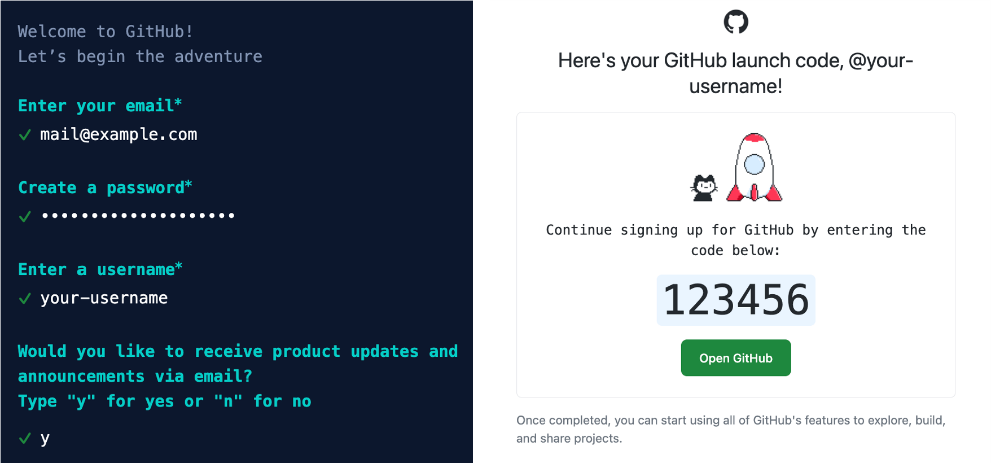

図4.2 github.com の登録ページと確認メール

以上の手順で GitHub アカウントの準備は完了し、最初のリポジトリの作成への道が開けました。

## 最初の GitHub リポジトリの作成

GitHubにログインすると、新規リポジトリを作成するためのメニューが表示されます。新規ユーザーの場合は、**Create repository** ボタンが直接表示されます。既存ユーザーの場合は、リポジトリ一覧にある **New** ボタンを使います。

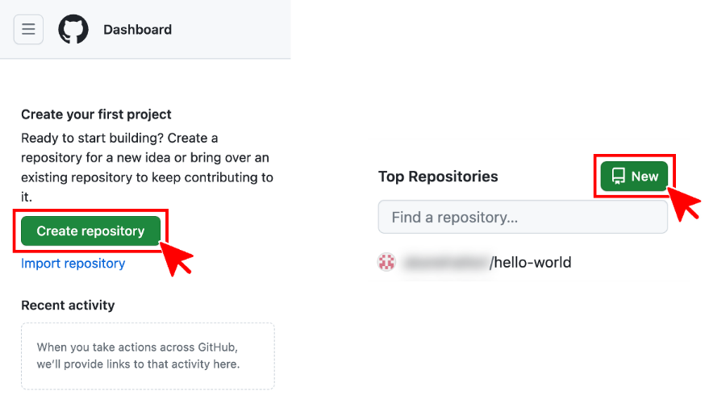

図4.3 - 新規リポジトリ作成ボタン

リポジトリ作成設定画面が表示されます。

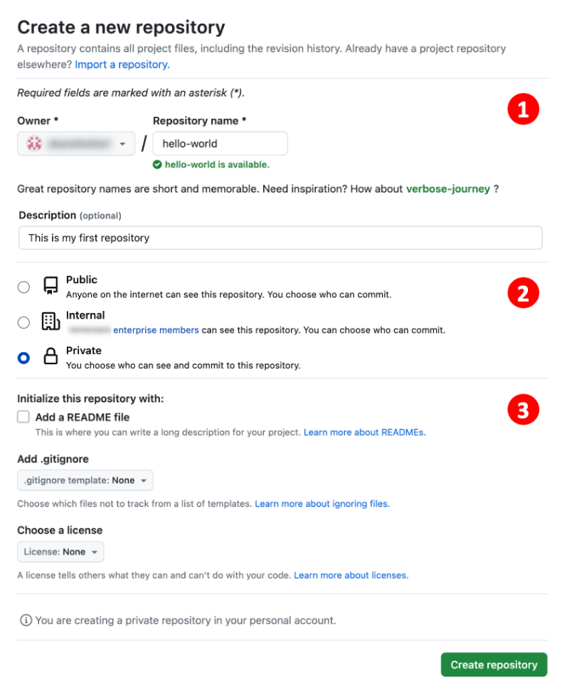

図4.4 - 新規リポジトリの作成

リポジトリを作成する際には、以下の点を決定します：

- **リポジトリの場所**: 自分自身や所属する組織を所有者として選択し、リポジトリに名前を付けます。
- **可視性**: リポジトリを公開するか非公開にするかを選択します。GitHub Enterpriseのメンバーは、内部リポジトリのオプションもあります。
- **初期化**: リポジトリをREADME.md、.gitignore、LICENSEで初期化することができます。README.mdはプロジェクトの概要を説明し、ライセンスはプロジェクトの使用方法や貢献のルールを定めます。既存のプロジェクトをアップロードする場合は、これらのオプションは選択しないでください。

すべての詳細を入力したら、**リポジトリを作成**ボタンをクリックして新しいリポジトリを作成します。これで、ローカルファイルをアップロードする準備が整います。

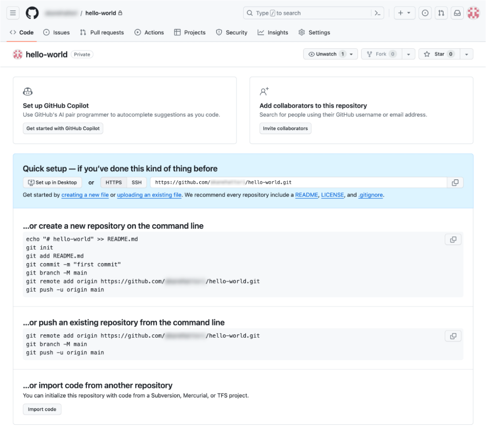

図4.5 - 作成されたリポジトリ

## 新規ファイルの作成

新規ファイルは以下の手順で "creating a new file" より作成できます。

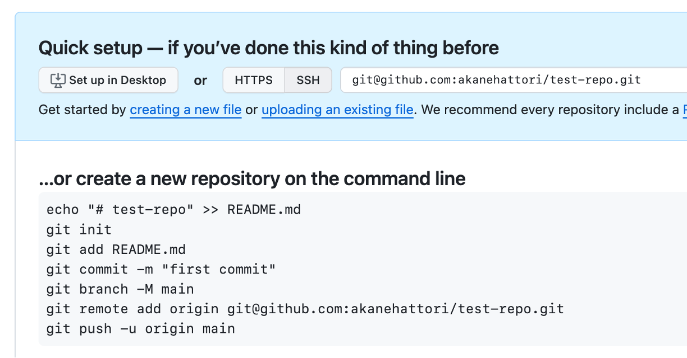

ファイルに内容を書き、ファイル名を追加しましょう。
README.md というファイル名を入力し、ファイルの概要を書くことをおすすめします。

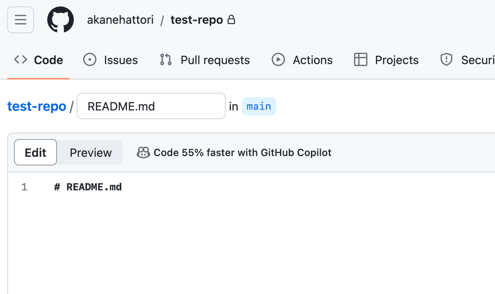

最後にコミットメッセージを入力し、**Commit changes** ボタンをクリックします。

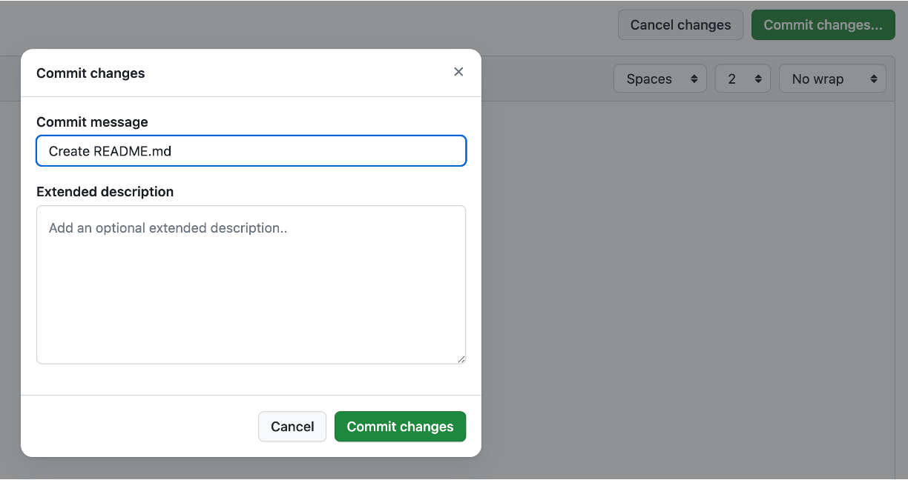

## GitHub のコードを調べる

それでは、プッシュしたコードが GitHub 上でどのように見えるのかを調べてみましょう。

GitHubリポジトリのメインページにアクセスすると、最新のファイル、README.md（存在する場合）、リポジトリの詳細が表示されます。これでプロジェクトの概要をすばやく理解できます。

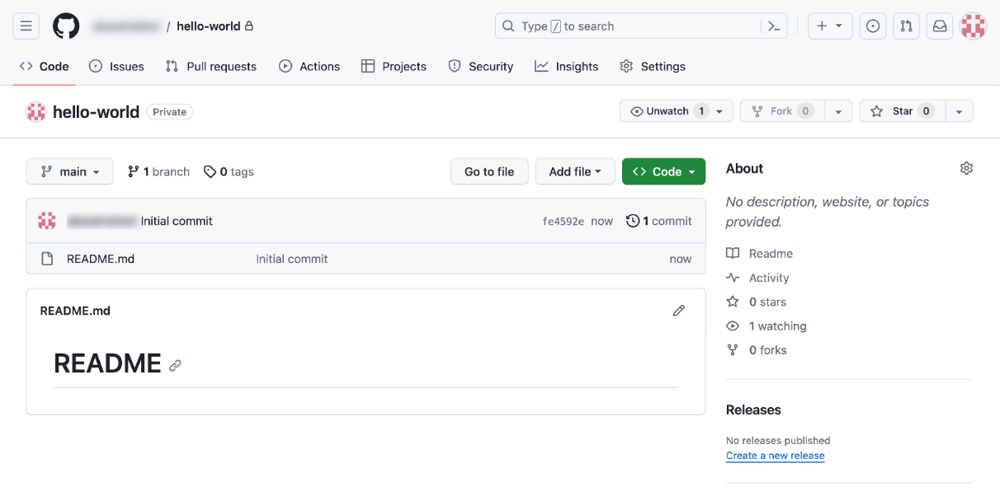

図4.11 - コードをプッシュした後の GitHub リポジトリのページ

### GitHub でのコードの編集

重要な機能のひとつは、GitHub 上でコードを直接操作できることです。インターフェイスを使ってファイルを追加したり編集したりすることができ、ちょっとした変更やクイックフィックスに特に便利です。

1. 右上の *edit* ボタンをクリックして編集モードに入ります。

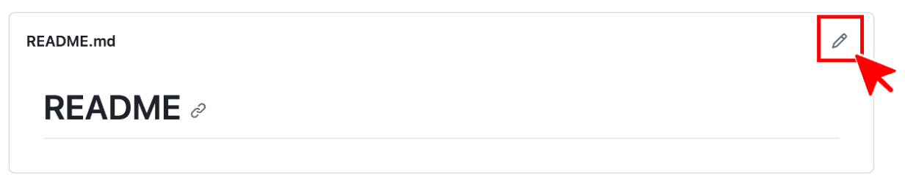

図4.12 - 編集モードに入る

2. 編集して変更をコミットすることができます。これはコードベースに直接コミットすることを覚えておいてください: 
([README.md](https://gist.github.com/yuhattor/4cfe3ea6488c4e8b04a793943d83e092)の例)

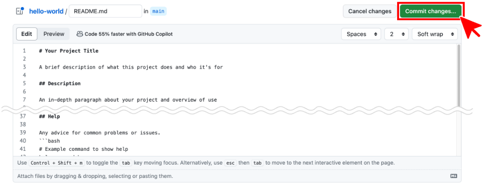

図4.13 GitHub の編集ページ

3. このアクションは、変更内容をリモートリポジトリに直接コミットします。しかし、コミット先やブランチを柔軟に選択することもできます。デフォルトは現在作業中のブランチですが、同時に新しいブランチを作成するオプションもあります。新しいブランチを作成した場合でも、後でそれを本流にマージすることができます。

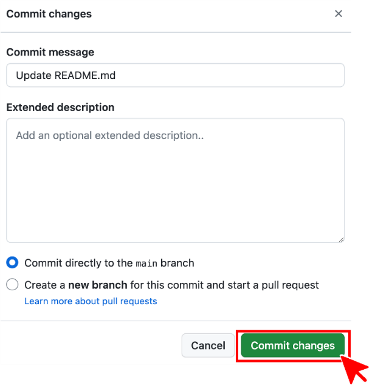

図4.14 - 変更をコミットする

4. これで、以下のスクリーンショットのように変更が反映されるはずです。

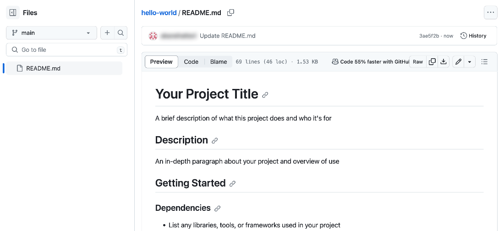

図4.15 - コミット後、コード画面に戻る

### GitHub でのコードと変更内容の確認

それでは、先ほど更新したコードを GitHub で見てみましょう。GitHub では、コードをより詳しく見るためにファイルブラウザにいくつかのビューを用意しています。

- **プレビュー**モードがデフォルトで、Markdownのような特定のファイル形式で表示されます。

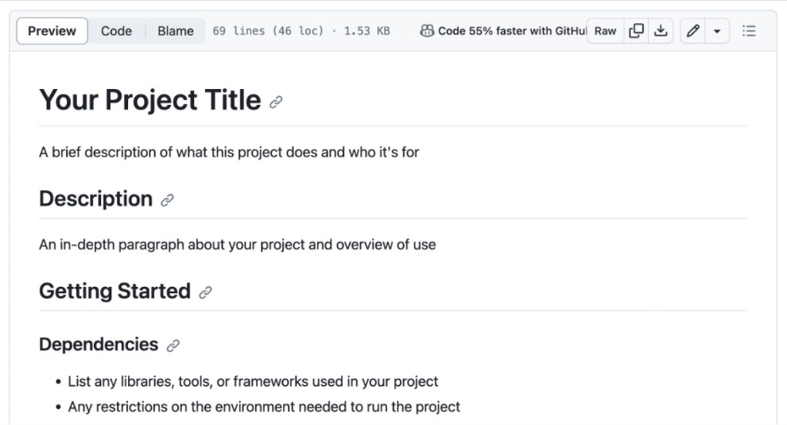

図4.16 - プレビューモード

- **Code**モードでは、最新のコミット時のファイルの内容が、美しいシンタックスハイライトとともに表示されます。

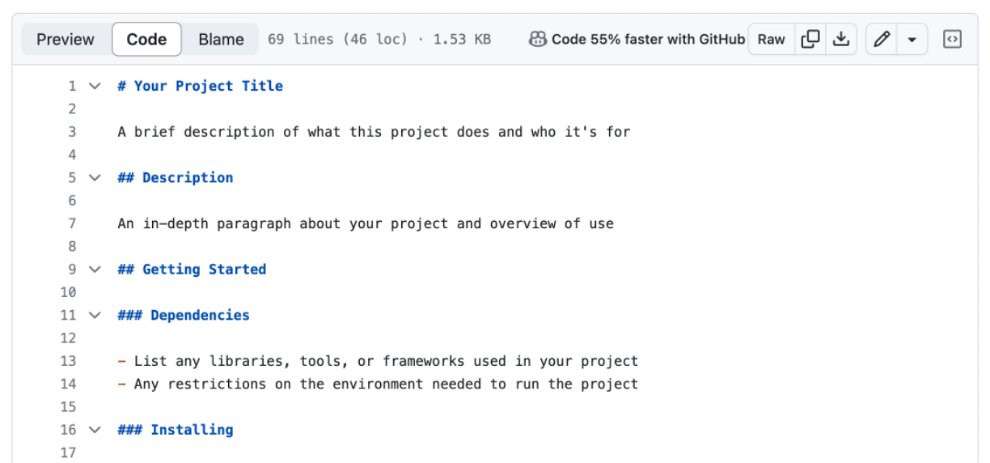

図4.17 - Code モード

- **Blame**モードは特に洞察力に富んでおり、ファイルを行ごとに分解し、誰がどのコミットで各行を最後に変更したかを表示します。これはコードの変遷を理解し、変更を追跡する上で非常に貴重です。

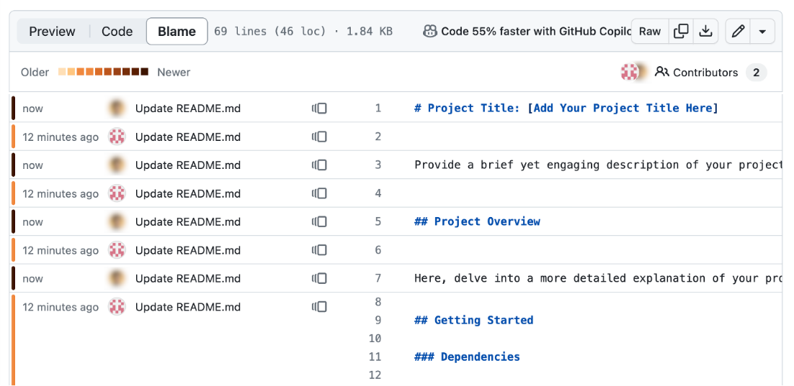

図4.18 - Blame モード

これは、ローカルでコードを取得してレビューするのではなく、まず GitHub 上でコードを見てみたいという場合に便利です。GitHub リポジトリのインターフェイスでは、プロジェクトのコミット履歴を調べることができます。この機能を使えば、各コミットの詳細や変更点を調べることができます。

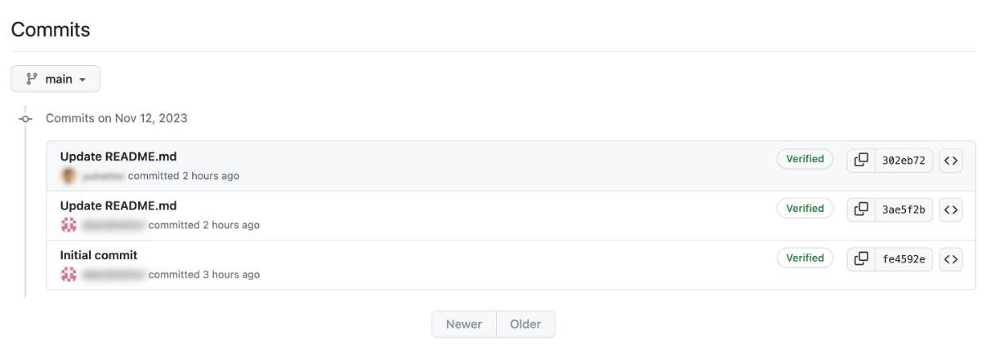

図4.19 GitHub の変更履歴

さらに、GitHub には変更履歴にコメントする機能があり、リポジトリで行われた特定の変更についてのディスカッションやフィードバックを行うことができます。

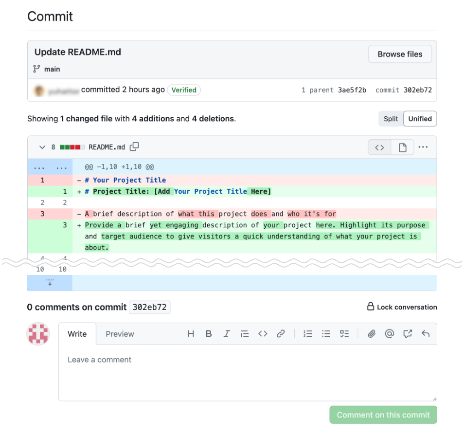

図4.20 GitHub のコミットビュー

> Exercise:  編集を数回実施して、それぞれの見え方がどう変わるか確認しましょう。

## git clone - GitHub リポジトリをワークスペースに持ち込む (今回はスキップ)

クローンやダウンロードといえば、どのリポジトリでもこれらのオプションがすぐに利用できます。リポジトリページに行って **Code** ボタンを押すと、これらのオプションがあることがわかります。クローンを作成すると、あなたのマシンにリポジトリのローカルコピーが作成され、オフラインでプロジェクトを作業することができます。

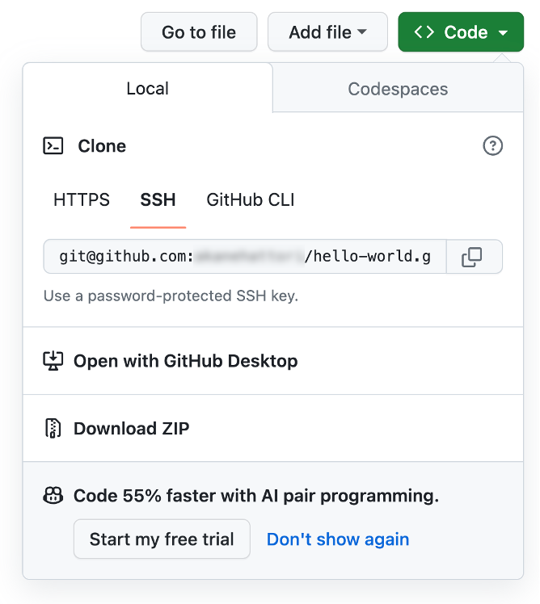

図4.21 git clone

git clone コマンドを実行するのは簡単で、GitHub のようなプラットフォームでホストされているプロジェクトに関わりたい人なら誰でも簡単にアクセスできます。リポジトリをクローンするには、クローンしたいリポジトリの URL が必要です。

git clone は、既存のリポジトリの正確なローカルコピーを作成できる中核的なコマンドです。このプロセスでは、現在のファイルを複製するだけではなく、リポジトリ全体を複製します。これには、すべてのファイルのバージョン、完全なコミット履歴、すべてのブランチが含まれます。git clone を使うことで、プロジェクトの完全かつ機能的なバージョンをローカルマシンに取り込むことができます。これにより、オフラインで作業できるだけでなく、プロジェクトの開発履歴を包括的に見ることができるようになります。

## Issues - GitHub におけるコラボレーション

GitHub Issuesは、GitHubにおけるコミュニケーションツールとして、共同作業に欠かせない存在です。単に問題を報告する場所としてだけでなく、プロジェクトに関連する様々な種類のタスクや活動を追跡するための包括的なシステムとして機能します。これには、バグ管理、機能強化の提案、GitHubリポジトリ内のその他の重要なタスクのモニタリングが含まれます。

DevOps環境では、GitHub Issuesは継続的なフィードバックとシームレスなコラボレーションを促進することで重要な役割を果たします。開発者がIssueにフラグを立てたり、チームメンバーが新機能を提案したり、関係者が機能強化の可能性について有意義な議論をしたりできる、透明で効率的なプラットフォームとして機能します。

GitHub Issuesを活用することで、チームはコラボレーションを促進し、プロジェクトに関わる全員が同じ見解を持つことができる共有スペースを作ることができます。

## Issueの作成

GitHubで初めて Issue を作るのは、最初は少し難しく感じるかもしれません。シンプルだからこそ戸惑うこともあります。でも、このやり方を覚えることは、チームでうまく働くためにとても大切です。

うまく作られたIssueが成功の鍵です。はっきりしていて簡単、そして役に立つ内容でなくてはいけません。
大事なのは、必要以上の情報を相手に与えずに、あなたの言いたいことをしっかり伝えるための背景を提供することです。問題を明確にし、なぜ重要なのかを説明し、どんな結果を望んでいるかをはっきりさせましょう。

このプロセスは、GitHubのリポジトリから始めます。もうすでにリポジトリがある場合や、新しく作ったばかりの場合でも、リポジトリのメニューに **Issues**のタブがあります。ここから新しいIssueを作成します。

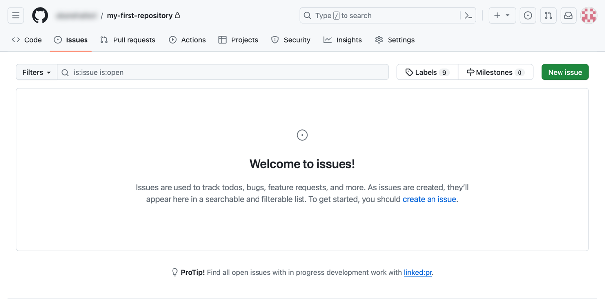

図4.24 - 新しいIssue

Issueを作成する操作自体は、実のところシンプルです。GitHubのインターフェイスでは、タイトルと詳細な説明のためのフィールド、それに担当者指定やラベル付けといったメタデータを設定するオプションが提供されています。重要なのはIssueの内容そのものです。GitHubはMarkdownというフォーマットを採用していますので、Markdownの基本的な書き方に慣れておくことが有益です。ただし、何よりも大切なのは、内容をシンプルに保つことです。MarkdownはMicrosoft Wordほど多機能ではありませんが、見た目がすっきりとしていて理解しやすいドキュメントを作成するのに適しています。

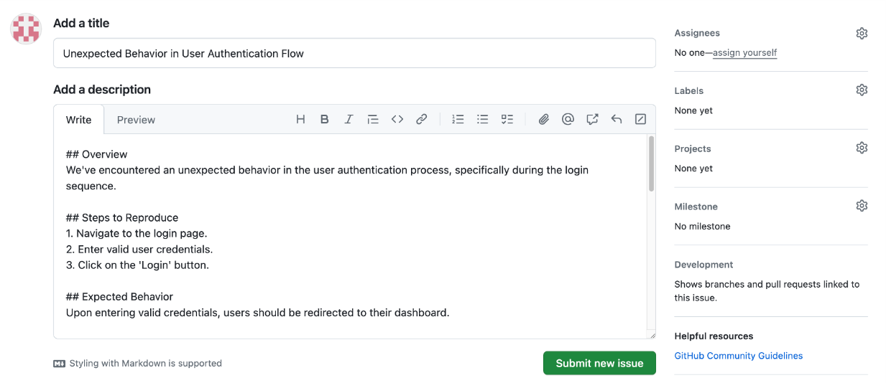

図4.25 GitHub でのIssueの作成

Issueの中でチームメンバーに割り当てたり、通知の内容で個人やチームに直接言及したりすることもできます。

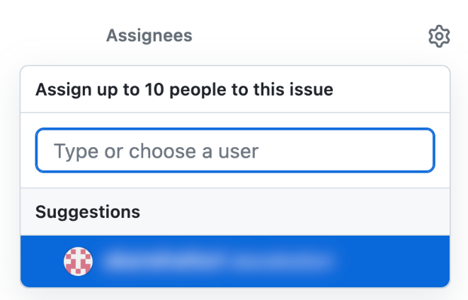

図4.26 - Issueを他のユーザーに割り当てる

タスクにラベルを付けることもできます (例: バグ、ドキュメント、改善)。カスタムラベルを作成することもできますが、デフォルトのラベルから始めて徐々に強化していくことをお勧めします。ラベルを使いすぎると、混乱や分類の難しさにつながります。チームや組織で特定のラベル基準を設けている場合は、それを守るのが一番です。

GitHub Issues の使い方はトップダウン式ではなく、コミュニティ主導のボトムアップ式が推奨されることが多いで。最初から厳格なルールを課してしまうと、オープンでアジャイルで協力的な文化を育むために必要な自由が制限されてしまいます。バランスを大切にしましょう。

チームが GitHub のワークフローに慣れてきたら、それに応じてアプローチを調整することが望ましいです。

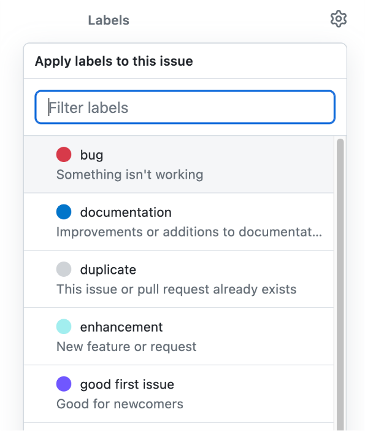

図4.27 - さまざまな種類のラベルを適用できる

最後に、投稿されたIssueが表示されます。

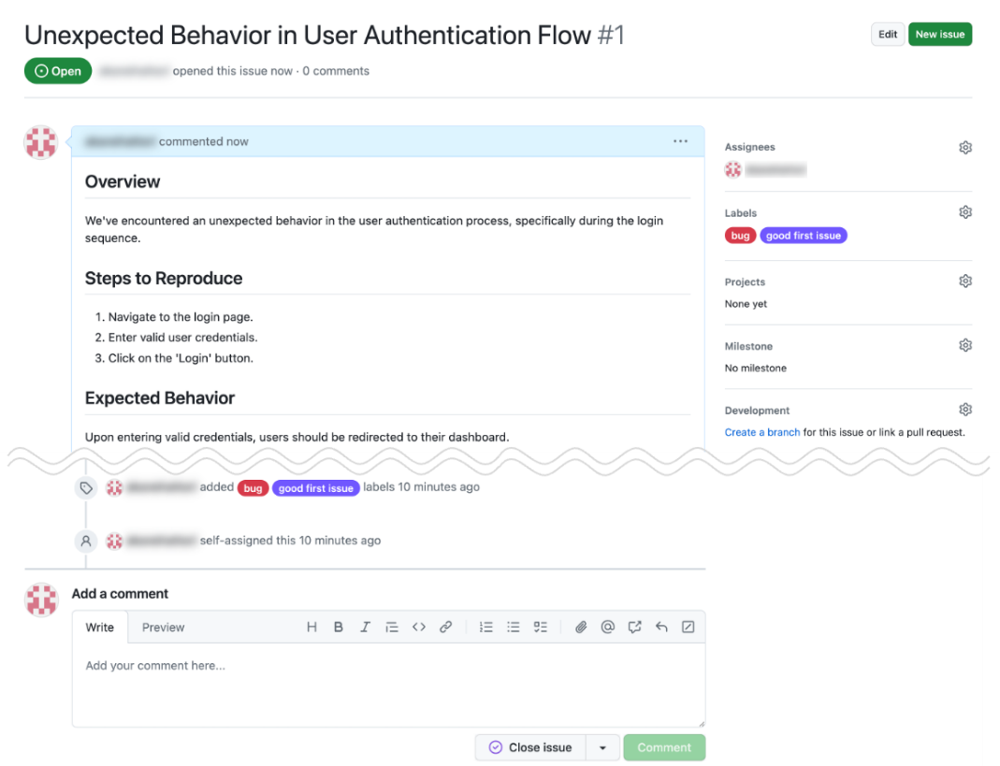

図4.28 - Issueの提出後

このように、GitHub でのIssue管理は簡単です。重要なのは、コラボレーションとコミュニケーションを促進することです。次のセクションでは、効果的なコミュニケーションのテクニックを掘り下げ、GitHub を使って組織内のコラボレーションを強化する方法を探ります。

### Exercise

1. マークダウン記法で、h1, h2, h3 の見出しを作成してみましょう。
1. マークダウン記法でリストを作成してみましょう。
1. マークダウン記法で太字、斜体でデコレーションをしてみましょう。
1. マークダウン記法でリンクを追加しましょう
1. コードブロックを作成してみましょう。
1. Issues に自分自身をアサインしましょう
1. Issues にラベルを付けましょう

マークダウン記法に関するURL: https://docs.github.com/ja/get-started/writing-on-github/getting-started-with-writing-and-formatting-on-github/basic-writing-and-formatting-syntax

### 参考資料

プログラミング言語 Rust では様々な RFC が Issue として起票されています。
アクセスし、どのように書かれているかを確認しましょう。

URL: https://github.com/rust-lang/rfcs

## GitHub におけるコラボレーションへの準備

この先、共有リポジトリで作業をします。
ご自身の環境でも作業の継続は可能ですが、更に効果的に体験していただくには、共有リポジトリでの作業をお勧めします。
GitHub のアカウントをチャット欄で共有してください。

URL: https://github.com/240123-handson/sample-repository

## GitHub Issuesの特徴 (概要)

透明性を促進し、開発者の体験を向上させるGitHub Issuesのユニークな役割

GitHub Issuesは、特に透明性とコラボレーションへのアプローチにおいて、ソフトウェア開発業界においてユニークなツールです。GitHubに不可欠なこのツールは、開発チーム、そしてより広範なオープンソースコミュニティの、プロジェクトにおけるコミュニケーションとコラボレーションのあり方を再定義しました。GitHubのIssuesの重要性は、バグ追跡や機能要求ツールとしての機能性だけでなく、オープンソース運動の理念を反映した、オープンで透明性の高い、コミュニティ主導のソフトウェア開発アプローチを育成する役割にある。

### 開発における透明性の重要性

ソフトウェア開発での「透明性」とは、ソフトウェアがどのように作られて、どう変わって、どう管理されているかを、開発者から一般の利用者まで、関わる人全員がちゃんと見て理解できることを意味します。この透明性が大切な理由を簡単に説明します。

- **チームワークが良くなる**：プロジェクトのことがみんなに見えると、チームでの協力がスムーズになります。同じ情報が共有されるので、みんなでより良い判断ができ、プロジェクトの目標や問題への理解も深まります。

- **責任感が増す**：透明性があると、誰が何をしているかが明確になります。メンバーは自分の仕事が他の人に見られていると感じると、その仕事にもっと責任を感じ、自分の仕事に対するコミットメントが増します。

- **信頼が生まれる**：透明性はチーム内や利用者、顧客など外部の人たちとの信頼関係を築きます。この信頼は、長期にわたるプロジェクトの成功や、ユーザーを大切にする信頼性の高いソフトウェアを作るために非常に大切です。

### GitHub Issues: 透明なコラボレーションの触媒

GitHub Issues は、この透明性の高いアプローチを例証しています。詳細で階層的なパーミッションを許可するツールとは異なり、GitHub Issuesは通常、よりオープンなアクセスモデルで運営されています。すべてのIssue、ディスカッションスレッド、決定事項はチームメンバー全員に公開され、オープンソースプロジェクトでは一般公開されることもあります。このオープン性は情報のサイロ化を防ぎ、組織やコミュニティ内のどのレベルからでもアイデアやフィードバックが得られるボトムアップの文化を促進します。

このアプローチは、コミュニティへの貢献、責任の共有、オープンな対話を重視するオープンソース開発の理念とシームレスに一致する。同様のモデルを社内で採用することで、企業はこのオープンソースアプローチのメリットを享受し、組織の縦割りを打破し、チーム内にコミュニティのような雰囲気を醸成することができる。これは、開発者がイニシアチブを取り、アイデアを提供し、健全で建設的な議論に参加することを奨励するものである。

### GitHub Issues: 透明性を基盤とした協調作業の促進

GitHub Issuesは、透明性を重視した協同作業の優れた例です。詳細な階層的な権限設定を提供する他のツールとは異なり、GitHub Issuesは一般的により開放的なアクセスモデルを採用しています。全てのIssue、ディスカッションスレッド、および決定事項はチームメンバー全員に公開されることが多く、オープンソースプロジェクトでは一般にも公開されることがあります。このような開放性は情報の孤立を防ぎ、組織やコミュニティ内の全レベルからのアイデアやフィードバックの流れを促進するボトムアップ型の文化を奨励します。

このアプローチは、コミュニティへの貢献、共有責任、オープンな対話を重視するオープンソース開発の理念と密接に連携します。同様のモデルを企業内で採用することにより、企業はオープンソースアプローチの利点を享受し、組織の階層構造を破壊し、チーム内でコミュニティのような雰囲気を醸成することができます。これは開発者が自ら主導権を取り、アイデアを提供し、健全で建設的な議論に参加することを促進するものです。

### オープンソースに基づいた企業内協働

GitHubの「Issues」機能を使用することで、オープンソースの作業方法を社内に導入し、開発者の業務体験を向上させることが可能です。オープンソースの協力的で透明性の高い手法を社内でも採用することで、開発者は自分の仕事がどのような影響を及ぼしているのかをより明確に把握でき、仕事範囲を超えた議論に積極的に参加し、自分の仕事が評価されていると感じるようになります。このようなオープンな環境は、チームの連帯感を強化し、モチベーションを高め、新しいアイデアや生産性を大幅に向上させることができます。

さらに、GitHubの「Issues」機能とオープンソースモデルが促進する透明性と開放性は、価値ある学習の機会を提供します。開発者は互いから学び合い、異なる視点から洞察を得ることができ、多様な問題や解決策に触れることで成長します。このような環境は、人材の確保やチームのモチベーション及び生産性の維持に不可欠であり、個人的及び専門的な成長を促進します。

## ブランチについて

別資料を参照

https://docs.github.com/ja/pull-requests/collaborating-with-pull-requests/proposing-changes-to-your-work-with-pull-requests/about-branches

## GitHub でのブランチの管理

GitHub でのブランチの管理は簡単です。ここでは、GitHub でのブランチ管理の概要を説明します。

まず、リポジトリ内の異なるブランチ間を移動するのは一般的な作業です。GitHub では、リポジトリページの一番上にあるブランチのドロップダウンメニューで簡単にブランチを切り替えることができます。この機能によって、あるブランチから別のブランチへ素早く移動することができ、プロジェクトのさまざまなバージョンや段階を効率的にレビューできるようになります。

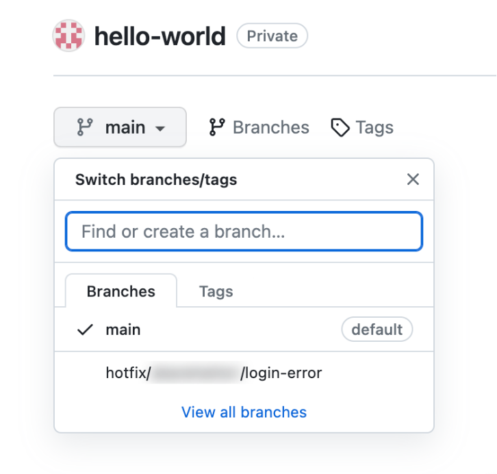

図4.21 - GitHub でのブランチの切り替え

複数のブランチを持つリポジトリでは、特定のブランチを見つけるのが難しくなることがあります。GitHub では、ブランチのドロップダウンメニューに検索機能を用意しています。この機能を使えば、目的のブランチをすばやく絞り込んで見つけることができ、時間を節約してワークフローを改善することができます。

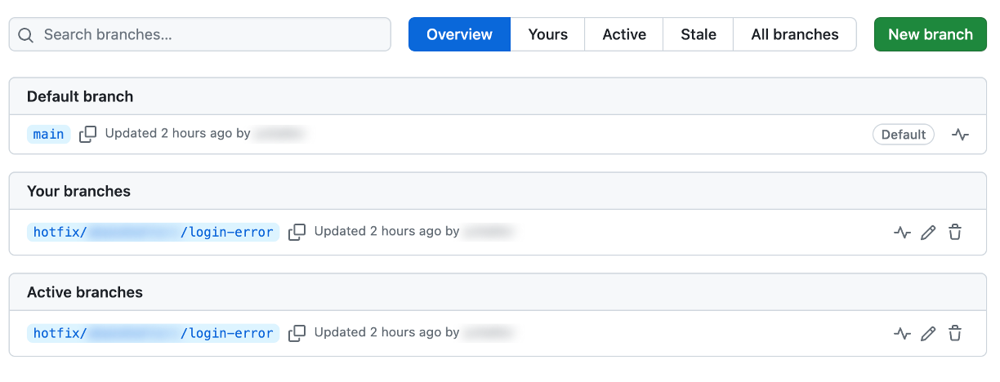

図4.22 - GitHub でのブランチの検索

新しい開発を始める際には、新しいブランチを作成することがよくあります。GitHub では、この新しいブランチを作成する手順を単純化しています。新しいブランチに名前をつけたり既存のブランチをもとにしてみたりすることで、新しい機能や実験のための分岐を簡単に行うことができます。

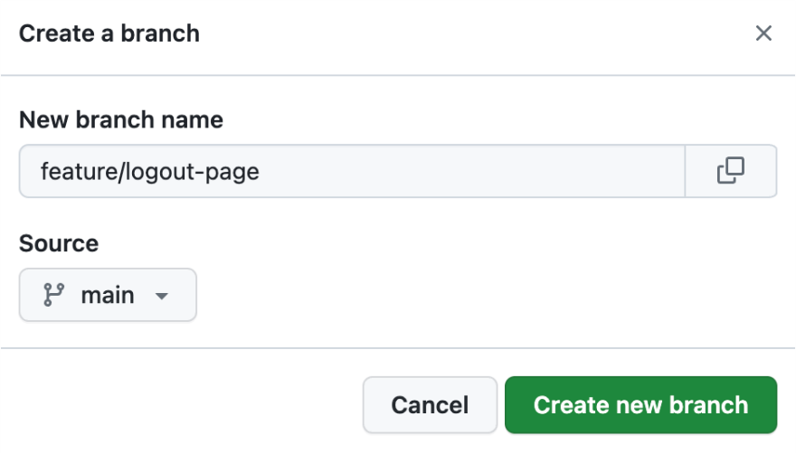

図4.23 - GitHub でのブランチの作成

GitHub のブランチ管理機能は、ひとつのリポジトリ内で複数の開発ラインをシームレスに効率よく扱えるようにするものです。プロジェクトの状態を切り替えたり、特定のブランチを探したり、開発用の新しいブランチを作成したり。GitHub のインターフェイスは、これらの作業を直感的でわかりやすいものにしてくれます。ブランチ管理へのこの合理的なアプローチは、整理された生産的な開発環境を維持するために不可欠です。

### Exercise

ブランチどんなブランチがあるかを見てみましょう。

- ブランチのリストからは何が閲覧できますか?
- ブランチに対してどのようなオペレーションが行なえますか?

## Pull Requestの作成

まず、GitHub でリポジトリを作成します。このハンズオンコマンドラインインターフェイスではなく GitHub の UI に焦点を当てます。README.md ファイルしかないリポジトリを出発点と考えましょう。このファイルに詳細な内容を追加し、Pull Requestを提出してマージするのが目標です。

### Exercise

- 新しいブランチを作り、編集をしてみましょう。
- README.md に自分の名前を足してみます。

**注意点**

- main に直接コミットするのではなく、新しいブランチを作成します
- ブランチ名は、自分の名前を使ってください (例: ```yuhattor/adding-name-to-readme```)
- ブランチを作成したら、GUI から README.md を編集して自分の名前を追加します

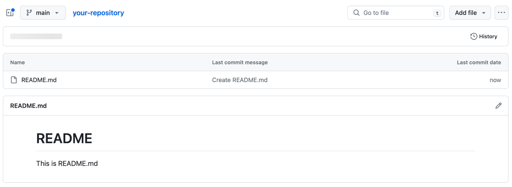

図4.30 - リポジトリのページ

最初のステップでは、adding-details-to-readme という名前のブランチを作成します。このブランチで編集を行い、メインブランチにマージします。Git コマンドを使用して新しいブランチを作成したりプッシュしたりすることもできますが、GitHub にはこのための直感的なインターフェイスも用意されています。左上のブランチドロップダウンボタンを使って、メインブランチから派生したブランチを作成します。

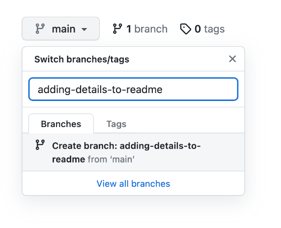

図4.31 - ドロップダウンメニューによる新しいブランチの作成

ブランチが作成されると、メインブランチやマスターブランチだけでなく、どのブランチに対しても変更を加えることができるようになります。

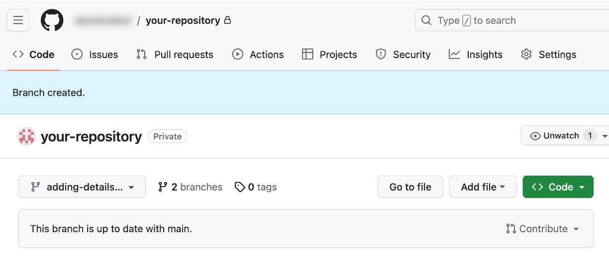

図4.32 - ブランチ作成の通知

それでは README.md を編集しましょう。編集を始める前に、左上のドロップダウンメニューで正しいブランチであることを確認してください。そして、右上の編集ボタンを使って README ファイルの編集を始めます: 

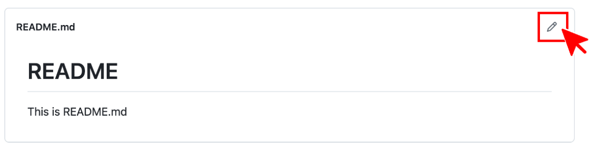

図4.33 - 編集ボタンをクリックする

README.md ファイルはリポジトリの顔であり、入り口であり、チームメンバーや新しい貢献者を歓迎します。ここであなたの想像力を膨らませ、魅力的な README を作りましょう:

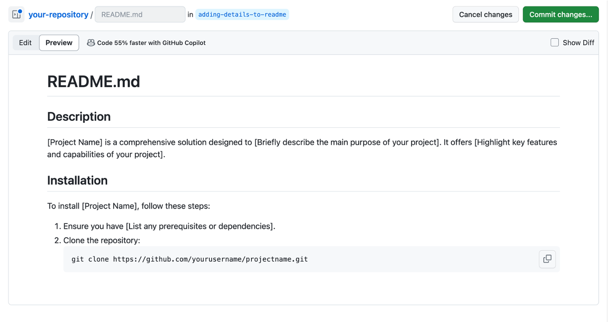

図4.34 - README.mdファイルを編集する

さて、これで準備は整いました。コミットを反映させましょう。すでに編集用のブランチに入っているので、編集した内容をそのままコミットしてもかまいません。しかし、メインブランチにいる状態で編集ウィンドウを開いてコミットすると、新しいブランチを作成するオプションが残ってしまいます。しかし、最初は意識的にブランチを作ってコミットしたほうが安全です。一方、GitHub にはブランチ保護ポリシーの設定があり、main、production、release といったチームの共有環境に直接コミットすることはできません。このことは、この章の後で説明します。

タイトルが Git のコミットメッセージになるので、これまでの章を読みながらよく考えてコミットしましょう。

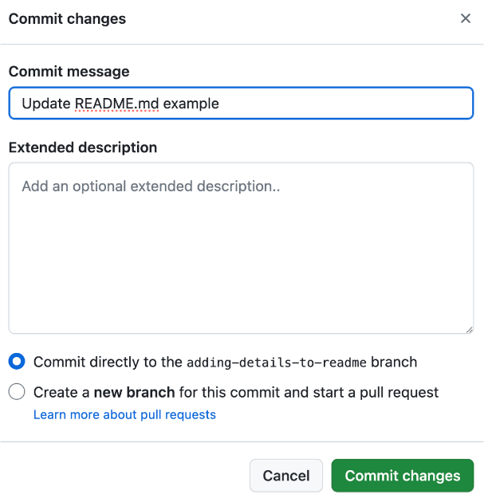

図4.35 変更のコミット

変更がコミットされると、リポジトリのトップページにPull Requestを作成するためのアラートが表示されるでしょう。アラートが表示されなかったり、別のブランチを選択したい場合は、**New Pull Request** ボタンからPull Requestを作成することもできます。

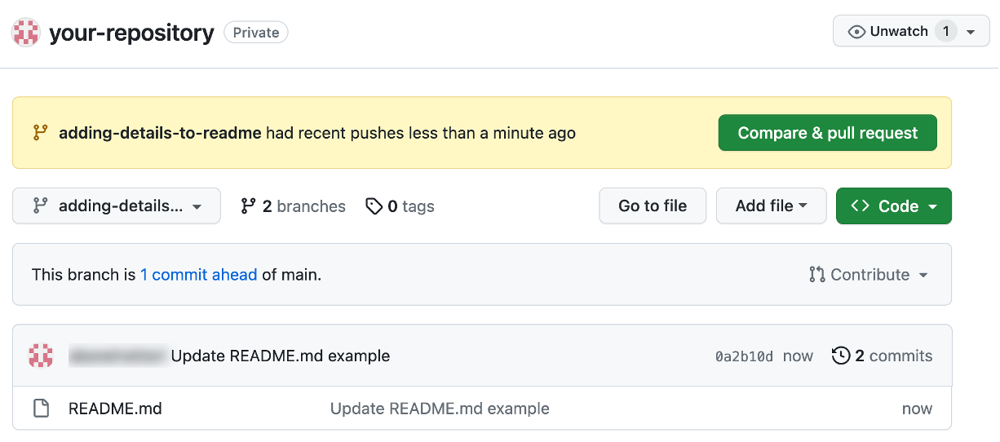

### Exercise

さて、次は Pull Request を作ってみます。
- Pull Request を作成してみましょう
- レビューのためのコメントを書いてみましょう。
- Pull Request は自分にアサインをして、Reviewer には レビューしてもらいたい人を指定します
- 必要に応じて Issue をどう紐付けられるか確かめてみましょう

図4.36 - Pull Requestのアラート

このアラートが表示されなかったり、別のブランチを選択したい場合は、**Pull Requests** タブの下にある **New Pull Request** ボタンをクリックして、同じプロセスを開始できます。

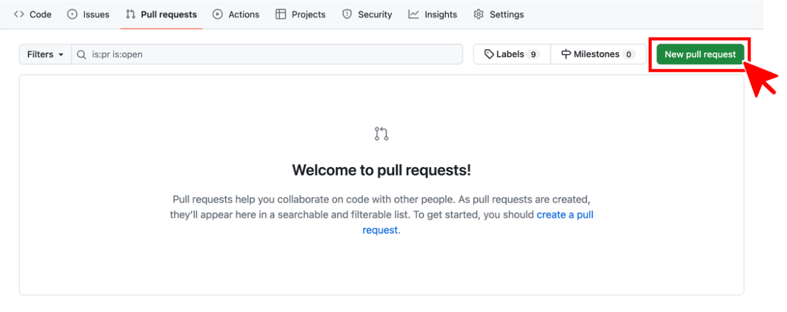図4.37 - 新規Pull Requestボタンをクリックする

UI を見ているとアラートに従って、あるいは**New Pull Request**ボタンをクリックして、Pull Requestページにたどり着くかもしれません。このページは変更履歴を確認する場所です。

GitHub での変更の表示方法はさまざまです。図に示すように、差分 (diff) はインラインで表示され、コードの各行に散りばめられています。また、GitHub では差分を並べて表示するスプリットビューもあります。このように分割して表示することで、元のコードと変更後のコードをより明確に比較することができます。

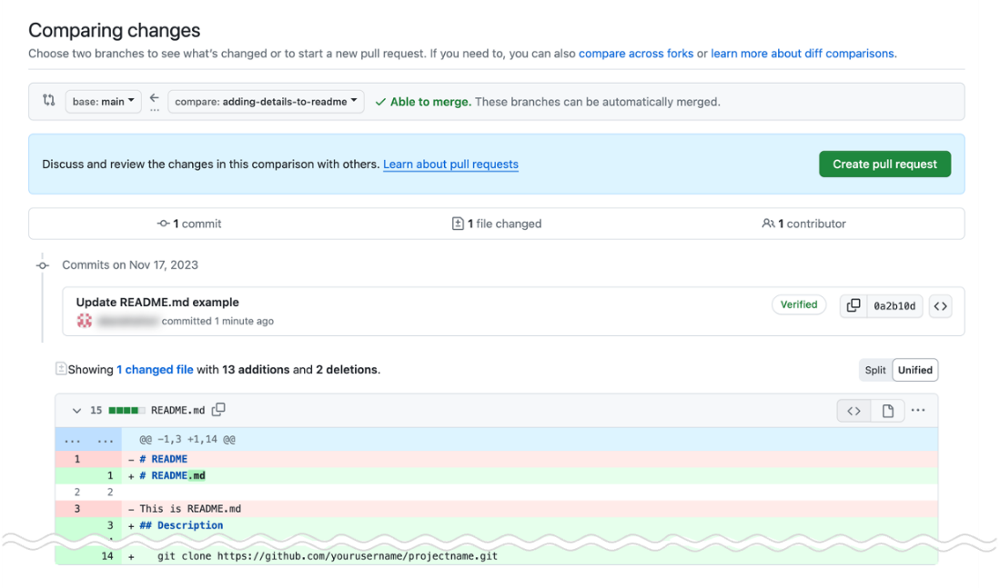

図4.38 - 変更点のレビュー画面

満足したら、PRを書きましょう。よいPRには、明確なタイトル、詳細な説明、指定されたレビュアーが含まれます。レビュアーについては、個人またはチームを指定できます。ここでの内容は、Issueに書く内容と多少似ています。

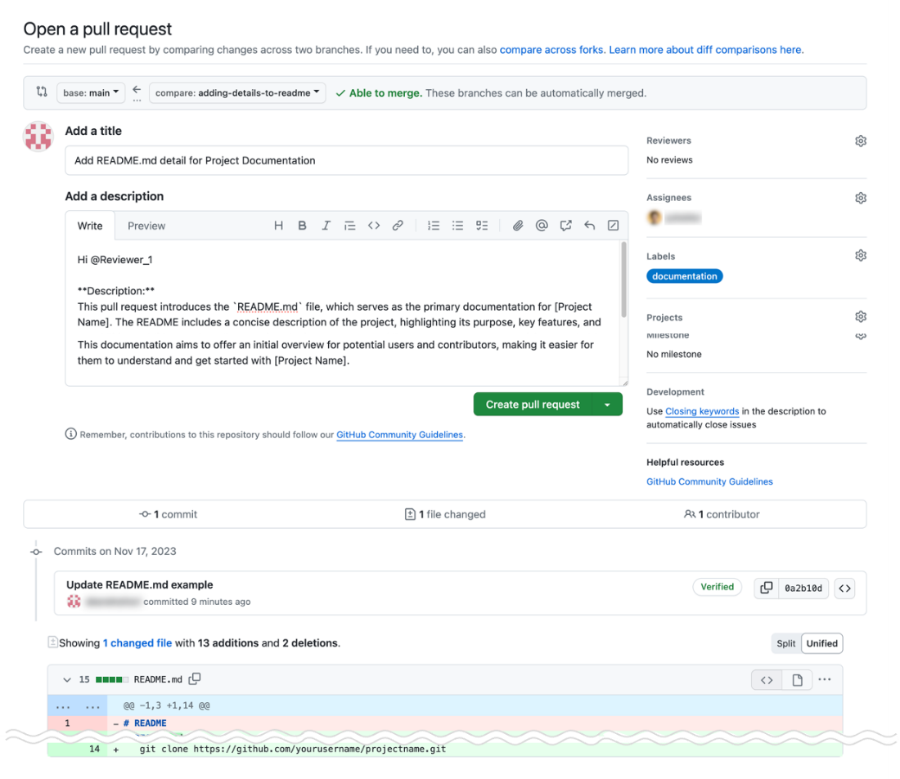

図4.39 - コミットの違いを確認できる

さてここでも文章力が試されます。ここで書くときに気をつけるべき内容は、前のセクションでIssuesについて気をつけたことと同じです。読みやすいマークダウン形式で書きましょう。しかし、この文脈では、これらのツールの明確な目的を理解することが重要です。Pull Requestの主な目的はマージされることであり、通常は承認権限のある特定の個人宛に送られます。対照的に、Issueはより広く、不特定多数に向けて発信することができます。したがって、このPull Requestの説明を書く際には、誰がレビューするのか、どのように書くのかを考慮することが重要です。

もしレビューが特定の人によって行われるのであれば、理解や文脈が共有されているかもしれません。基本的なテクニックはIssueの場合と同じですが、対象読者に合わせてアプローチを変えることが重要です。

Pull Requestを作成する際に、2つのオプションがあることにお気づきでしょうか。直接Pull Requestを作成するか、ドラフトPull Requestを選択することができます。

下書きPull Requestも通常のPull Requestも、ユーザーインターフェイスに大きな違いはありません。しかし、ドラフトプル・リクエストは、プル・リクエストがまだ確定していないこと、作業全体がまだ進行中であること、未完成であること、特定の開発段階にあることを示すために使用されます。

これは中間レビューを可能にし、まだ正式なレビューを意図していないことを示します。レビュアーは通常、中間的な結果や報告書を受け取ることを評価する。初期のレビューは、貴重な洞察を提供し、チームと進捗状況を共有することができ、有益です。

極端な例ですが、git の空コミットを使えば、コードを一行も書かずにPull Requestを作成することができます。これは開発の初期段階から非常に有用で、チームメンバーやペアプログラミングのパートナーにコードをレビューしてもらうことで、ミスを早期に発見するのに役立ちます。したがって、Pull Requestのドラフトも活用することを強く推奨します。

### Exercise

もう一度、Branch の作成、Pull Request の作成を繰り返し、今度はドラフト Pull Request を作成してみましょう。

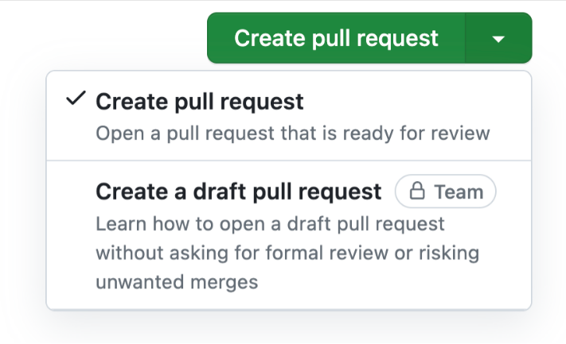

図4.40 - 別の選択肢もあります: ドラフトプル・リクエスト

## Pull Request をレビューする

何よりもまず、GitHub でのレビューのやり方を把握し、注意を払うべきベストプラクティスを探ることが重要です。GitHub を学び始めたとき、すぐに本格的なコードレビューに取り組むことはないかもしれません。しかし、レビューのやり方を理解することで、Pull Requestを書くときの期待値や内容に影響を与えることができます。

これらは徐々に改善できるプラクティスであり、最終的にはあなたのチームに最適化されるべきものであることを覚えておきましょう。

### Exercise

- 自分の Pull Request を自分でレビューして、コメントを追加してみましょう
- コード変更箇所に、コメントをつけてみましょう
- コード変更箇所に、Suggestion をしてみましょう

### レビューの基本

GitHub のレビューインターフェイスへのアクセスは簡単です。Pull Requestのページから **Files changed** タブを開き、変更されたファイルの数を確認します。

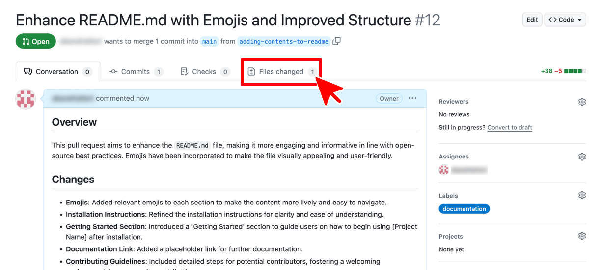

図4.45 - Pull Requestのレビュー用タブ

Files changed**タブを開いたら、内容を確認してください。下に示す行ごとの差分図に加えて、変更を並べて表示するオプションがあり、これは非常にお勧めです。行頭に-が付く行は削除を示し、+が付く行は追加を示します。

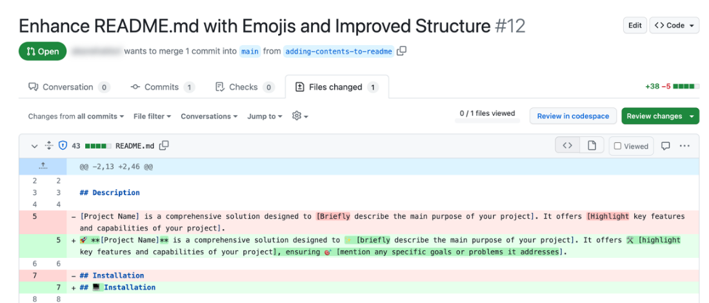

図4.46 GitHub での行ごとの差分の表示

特定の行の変更点をコメントするには、左の + ボタンを使います。複数の行を選択することもできるので、効率的に議論を始めることができます。

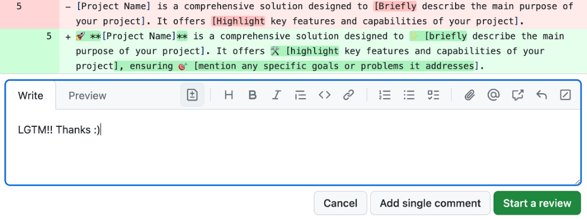

図4.47 - 変更点のレビュー

レビューの際、特定の変更を提案したい場合があります。これは、画面上の**提案**ボタンを押すことで行の内容をコピーすることができます。この内容をコメントで編集してください。ただし、削除された行にコメントを追加することはできますが、提案はできませんのでご注意ください。

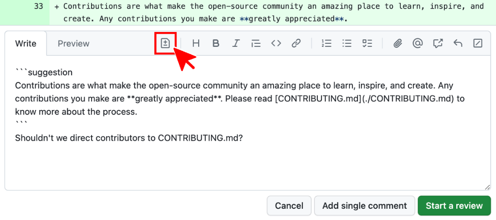

図4.48 GitHub UI の提案を使って変更を提案する

良い提案だと思ったら、**Add single comment** ボタンを押してコメントしましょう。複数のレビューコメントが必要な場合は、**Start a review** ボタンを使います。編集が多い場合に便利です。提案を含むレビューコメントは、Pull Requestスレッドとコード差分の間の両方に表示され、コードレビューをよりわかりやすくします。

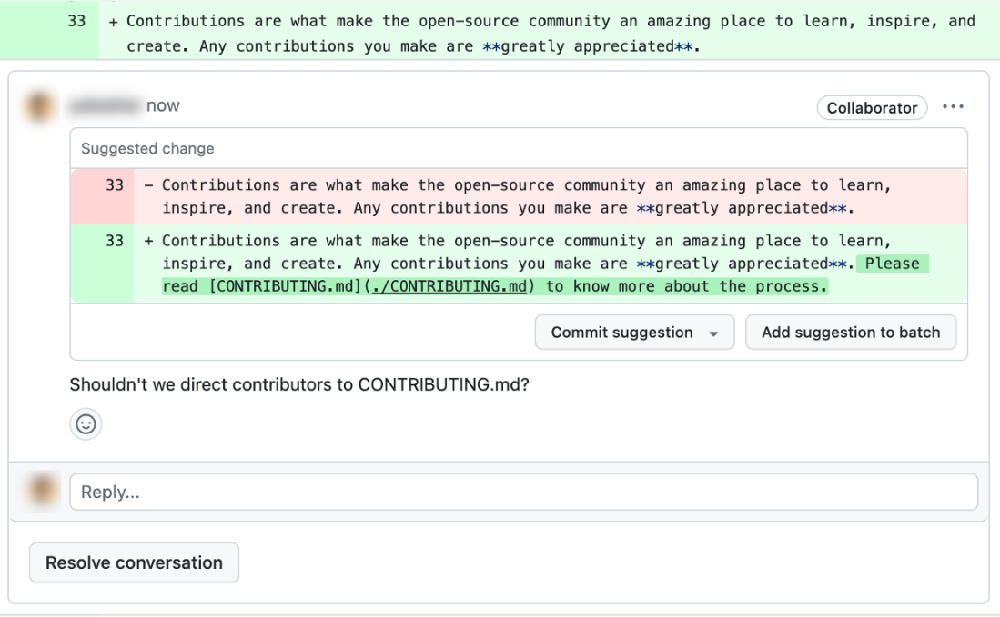

図4.49 - 提案がコメントとして表示される

レビューが完了すると、**Commit suggestion** と **Add suggestion to batch** というボタンが表示されます。GitHub の優れた点は、このような変更を CLI やエディタ経由ではなく UI から直接コミットできることです。**Commit suggestion** は個別の変更をコミットするもので、**Add suggestion to batch** は複数の変更をひとつのコミットとして記録するものです。これにより、Pull Requestに多くの変更があった場合に不要なコミットを防ぐことができます。コミット提案**ボタンを押すと、コミットメッセージと説明を入力する画面が表示され、その後変更がPull Requestブランチにコミットされます。

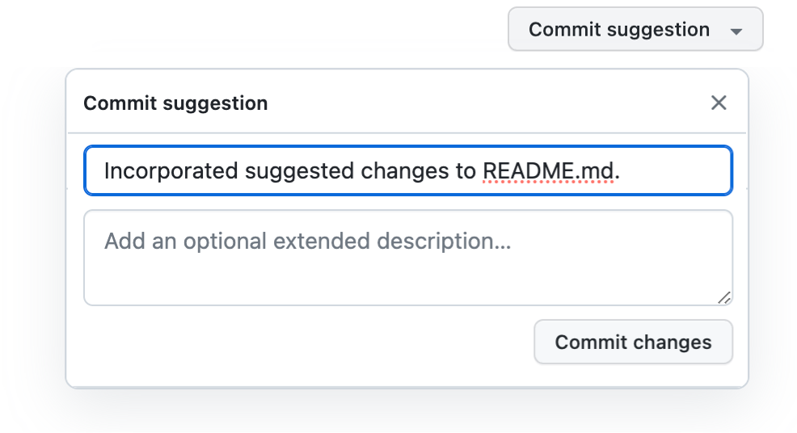

図4.50 - 変更のコミット

レビューが完了したら、いよいよレビューを行います。レビューを承認しても自動的にPull Requestがマージされるわけではありませんが、あなたが承認したことになることに注意してください。ここでは、**Commit**, **Approve**, **Request changes**から選択できます。**Comment**オプションはコメントのみ、**Approve**は承認、**Request changes**は必要な修正を提案するために使用します。

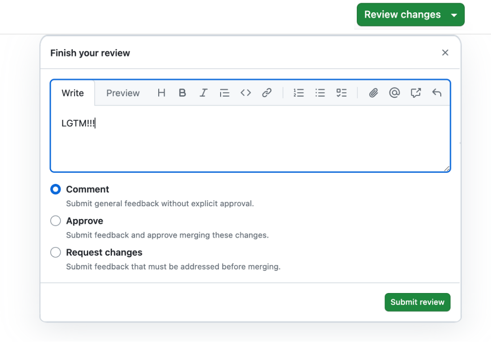

図4.51-レビューの3つのモード

承認すると、あなたのコメントと承認ステータスがこのようにスレッドに投稿されます: 

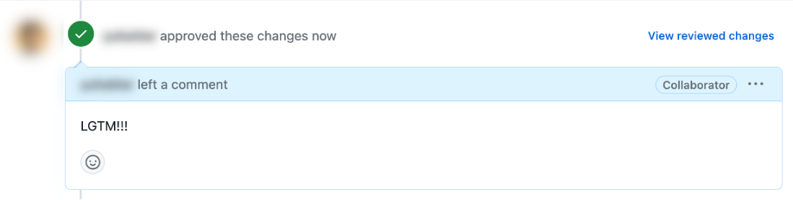

図4.52 - レビュー後のステータス

GitHubでは、GUIを利用してレビュープロセスを簡素化し、多様な機能を提供しています。コードの変更とそれに関連するコメントを組み合わせることで、文脈が豊かになり、レビュアー、レビュイー、そして過去の文脈を探求する現在のチームメンバーや将来のチームメンバーが情報をより深く理解し、効果的にコミュニケーションを取ることが可能になります。

この機能を適切に活用することにより、チーム内での透明性のあるコミュニケーションを実現することができます。

## Pull Request のマージ(Optional)

さて、適切なコミュニケーションを行ってレビューが完了したら、いよいよマージです。ここでの GitHub のすばらしいところは、コマンドインターフェイスではなく UI 上でマージができることです。このままマージを進めることもできますが、その前にオプションを見てみましょう。

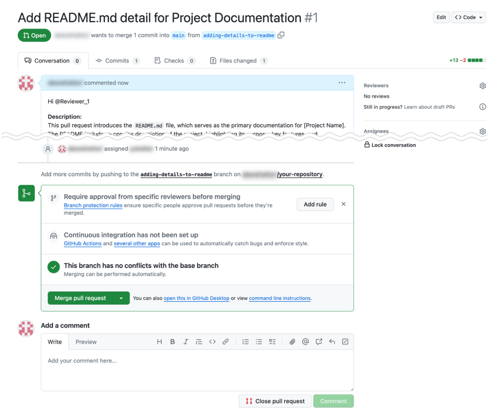
図4.41 - マージはウェブUIでできる

マージドロップダウンには3つのオプションがあります。マージコミットを作成するオプション、コミットをひとつにまとめてマージするオプション、そして最後にリベースマージを実行するオプションです。これらのマージテクニックについては前の章で説明したのでここでは詳しく説明しませんが、GitHub の素晴らしさは、Git の履歴を管理するためにこれらのオプションを柔軟に選択できることにあります。貢献の履歴を残したい場合は、まずコミットを取り込んで変更履歴をできるだけ残すようにします。一方、よりすっきりした履歴がお好みなら、squash や rebase merge といったオプションも検討しましょう。

### Exercise 

- マージを試しましょう。Approve でできます。
- README.md のファイルがコンフリクトを起こすこともありますので、その場合は、コンフリクトを解決してマージしてみましょう。

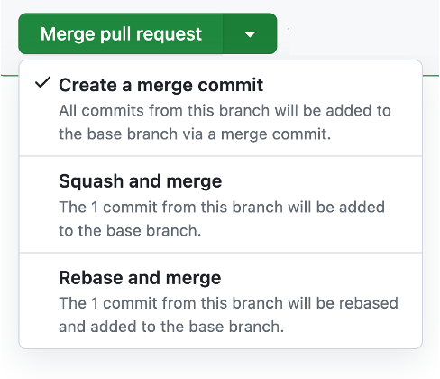

図4.42 - マージのオプション

今回はマージコミットを作成することにします。マージコミットの作成は簡単で、タイトルと説明を書くだけです。そして **Confirm merge** ボタンをクリックしてマージします。

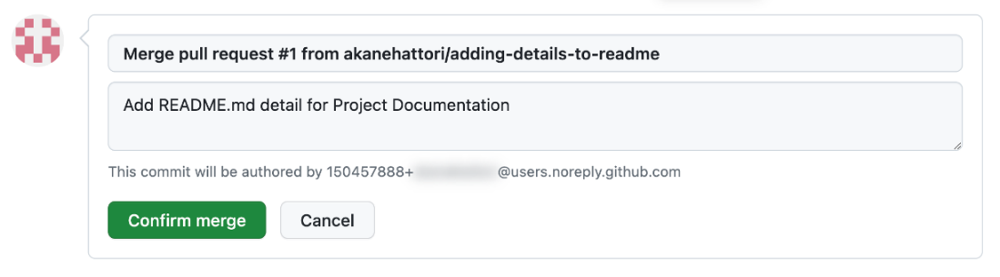

図4.43 マージコミットの作成

GitHub プラットフォームでマージが成功したことを確認します。

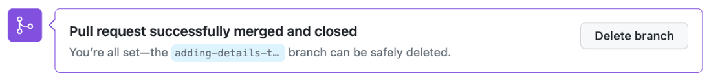

図4.44 - マージの成功を確認するための手順

GitHub上でのPull Requestの管理におけるその単純さについて、お気づきになられたことでしょう。このプラットフォームは、従来コマンドラインで実施されていた複雑な操作やレビュープロセスを、より効率的に行うことができる統合されたプラットフォームとして、合理的なユーザーインターフェイスを提供しています。

今後、Pull Requestの管理における微妙なニュアンスについて深く掘り下げて参ります。DevOpsを中心としたコミュニケーションフレームワーク内で、これらの機能を如何に巧みに利用し、プロジェクトや製品の成功に導くかに重点を置きます。また、ご注目いただきたい重要な側面についても、詳細に説明いたします。


## GitHub を最大限に活用する

GitHub の追加機能を調べることで、リポジトリ管理の経験を大きく向上させることができます。各機能を詳しく調べると膨大な量になってしまいますが、簡単に紹介することでその重要性がわかるでしょう。

## GitHub Projects - Issue と Pull Request を一元管理する

GitHub Projectsは、IssueやIssueドラフト、Pull Requestを一元管理できるツールです。

GitHub Projects は、GitHub Issues や GitHub Pull Requests だけでなく、より柔軟な管理を可能にします。GitHub Projects は、開発チームが GitHub 上で作業を整理、追跡、管理する方法を大きく進化させます。GitHub Projects は、Issues や Pull Requests のような直線的でやや限定された範囲とは異なり、プロジェクト管理に多面的なアプローチを提供し、現代のソフトウェア開発の協調的で反復的な性質とシームレスに連携します。

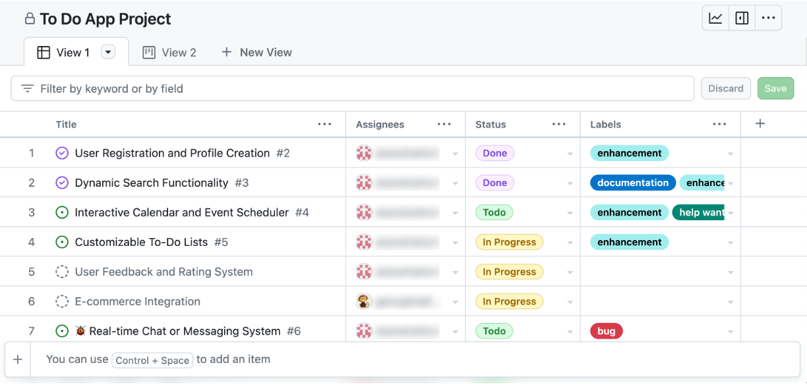

図4.53 - GitHub Projects テーブルビュー

GitHub Projects の中心には、ワークフローを視覚化するツールであるカンバンボードがあります。このボードでは、チームがワークフローのステージを反映したカスタムカラムを作成できます - **To Do** から **In Progress** や **Done** まで。これらのカラムにIssueやPull Requestをドラッグ＆ドロップするだけで、ワークフローの透明性が大幅に向上し、タスクの進捗をより直感的に追跡することができます。

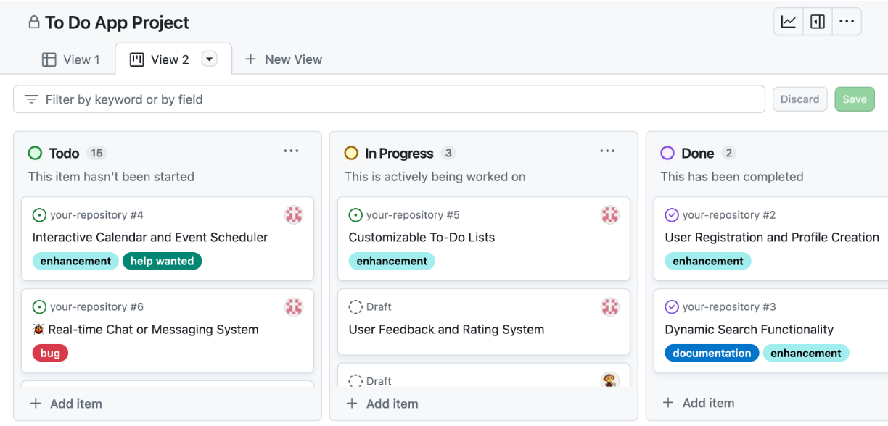

図4.54 - GitHub Projects のカンバンボードビュー

担当者やマイルストーンなどのツールによって、コラボレーションはさらに強化されます。マイルストーンは、重要な目標や期限に向けた進捗を追跡するのに役立ちます。このような構造化されたコラボレーションアプローチにより、チームメンバー全員がプロジェクトゴールと足並みをそろえ、その達成における自分の役割を理解することができます。

統合されたプロジェクトレポートもGitHub Projectsの特徴です。プロジェクトの進捗状況を包括的に把握することができます。DevOpeのメトリクスは、チームのパフォーマンスを評価し、改善点を特定する上で非常に貴重です。このデータ駆動型のプロジェクト管理アプローチにより、チームは十分な情報に基づいた意思決定を行い、ワークフローを最適化することができます。

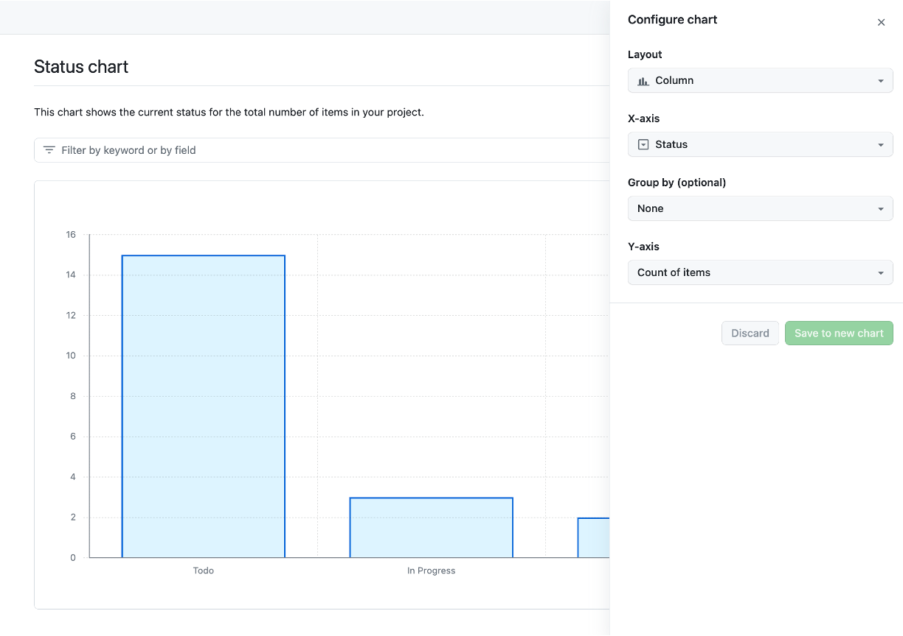

図4.55 - GitHub Projects ステータスチャート

GitHub Projects では、バグのトリアージや自動カンバンのような一般的なプロジェクトの定義済みテンプレートから、特定のチームのワークフローに合わせたカスタムテンプレートの作成機能まで、さまざまなプロジェクトテンプレートを提供しています。これらのテンプレートは時間を節約し、チームが信頼できる一貫した構造を提供します。

さらに、プロジェクトボードにIssueフィルタとPull Requestフィルタを含めることで、タスクを効率的に管理できるようになります。チームは、ラベルや担当者、マイルストーンなどでフィルターをかけることができ、最も重要なタスクを素早く見つけて集中することができます。

GitHub Projects の最も大きな利点の一つは、複数のリポジトリのIssueやPRを一つのプロジェクトで管理できることです。この機能は、複数のリポジトリにまたがるような大規模なプロジェクトでは特に有益で、全体的な視点とまとまりのある管理体験を提供します。

GitHub Projects は、従来のIssue追跡やPull Request管理の枠を超え、プロジェクト管理のための包括的で柔軟性の高い、高度にコラボレーティブなプラットフォームを提供します。GitHub Projectsの機能を使うことで、開発チームは生産性を高め、コラボレーションを改善し、プロジェクトを成功に導くことができます。GitHub Projects は、コラボレーション、効率性、透明性を優先する DevOps カルチャーの原則に合致しているため、現代のソフトウェア開発環境において優れたツールとなっています。

## GitHub リポジトリのマネジメント

GitHub リポジトリには、コラボレーションを促進する設定がたくさんあります。これらの設定は、失敗を恐れる必要性を減らし、レビュープロセスをより標準化することができます。ここではそのすべてを取り上げるわけではありませんが、特に重要なものをいくつか紹介します。

## リポジトリのルール - ワークフローの合理化とコード品質の確保

ブランチルールは、セキュリティとコラボレーションのバランスをとった方法でリポジトリを管理するために重要です。GitHub では、リポジトリや特定の機能に対するパーミッションを設定することはできますが、コードベースのパーミッションは提供されていません。書き込み権限だけに頼っていると、参加が制限されたりオープンなコミュニケーションが妨げられたりする可能性があります。ブランチルールによって、リポジトリ管理者はブランチ、特にmainブランチやmasterブランチのような重要なブランチに特定のポリシーを適用することができます。これらのポリシーには、Pull Requestのレビューやステータスのチェック、ブランチにプッシュできる人の制限などが含まれます。これらのルールを設定することで、チームは重要なブランチにマージされるコードがあらかじめ決められた品質基準を満たし、そのプロセスがチームのワークフローに沿ったものであることを確認できます。

ルールセットでは、さまざまな設定が可能です。特定のブランチだけに適用したり、管理者に権限を与えてバイパスさせることもできる。

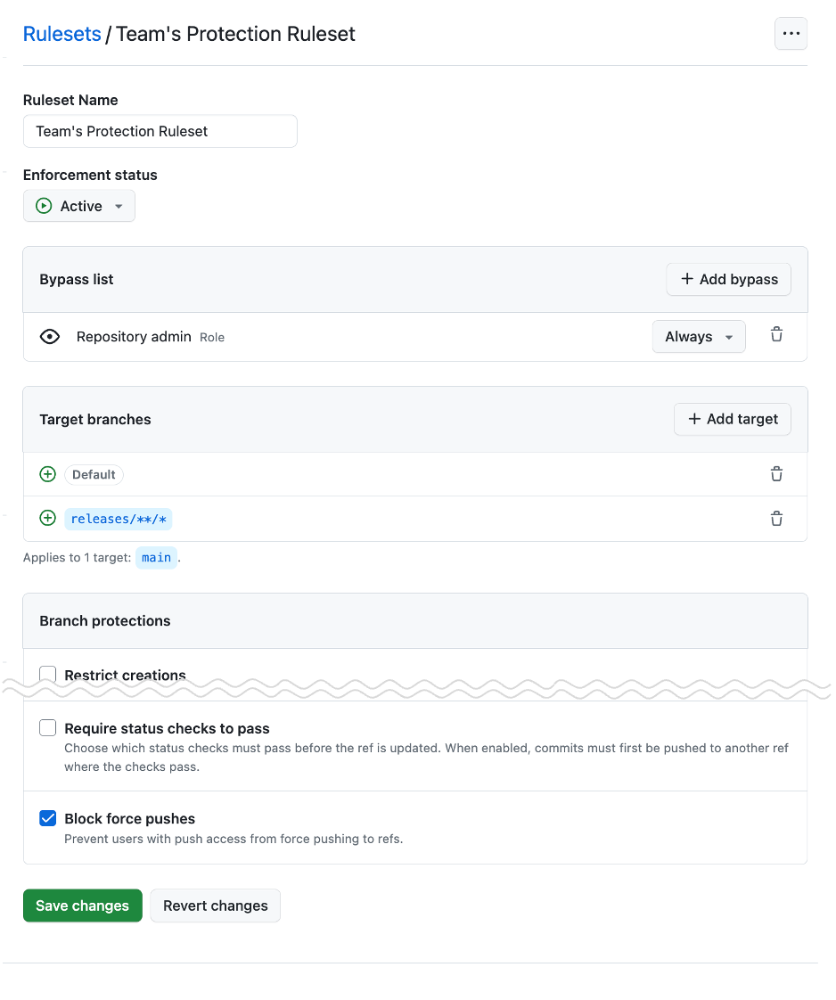

図4.59 - GitHub でのブランチルールの設定

ブランチルールの主な利点のひとつは、コードレビューの強制です。Pull Requestをマージする前に一定数の承認を得ることを義務づけることで、チームはすべての変更を精査し検証することができます。このピアレビュープロセスは、コードの品質を向上させるだけでなく、チームメンバー間の知識の共有とコラボレーションを促進します。

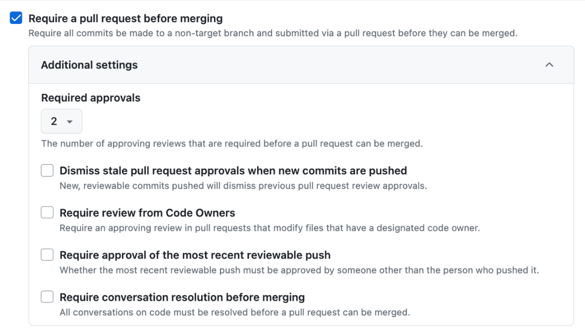

図4.60 - ブランチルールにおけるコードレビューの要件

ステータスチェックは、ブランチルールのもうひとつの重要な部分です。これらのチェックには、自動テスト、コード・リンターの結果、またはコードの品質と機能を検証する他のタイプの自動化プロセスを含めることができます。マージする前にこれらのチェックに合格することを要求することで、チームはバグや問題がメインのコードベースに入り込むのを防ぐことができる。

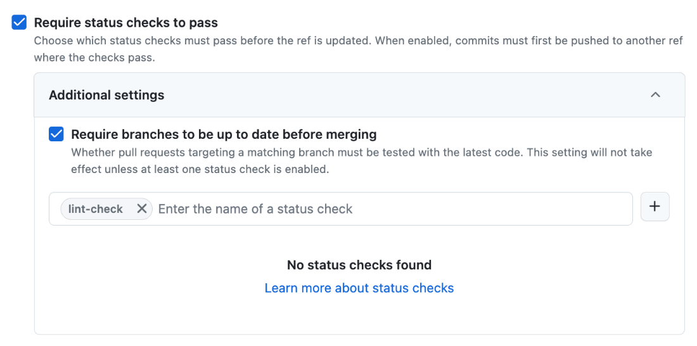

## CODEOWNERS - CODEOWNERSによるレビューとオーナーシップの合理化

GitHub の CODEOWNERS ファイルは、Pull Requestにレビュワーを自動的に割り当てたり、特定のコード領域の所有権を明確にしたりするための、シンプルで強力なツールです。このファイルは、リポジトリのルート、docs/、または .github/ ディレクトリに置かれ、個人またはチームをファイルパターンと一緒にリストアップします。これらのパターンに一致するファイルに変更が加えられると、指定されたコード所有者にレビューが要求されます。

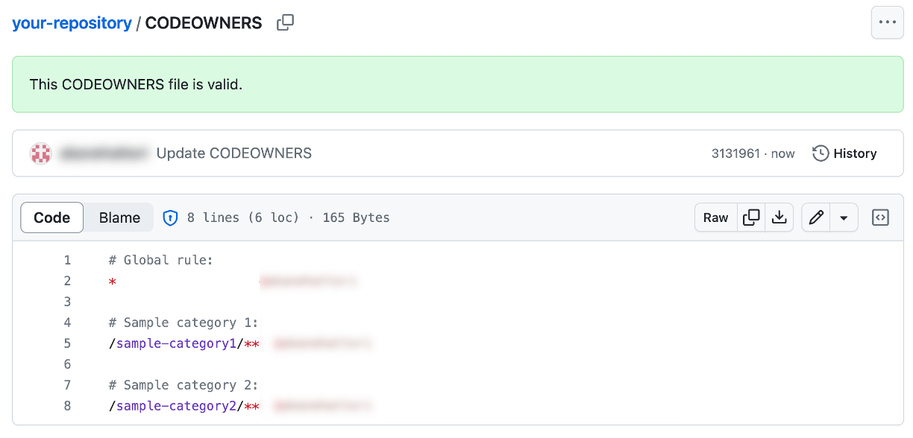

図5.62 - CODEOWNERSファイルの例

CODEOWNERSファイルを使用する利点は次のとおりです: 

- **自動レビュアー割り当て**: 適切なレビュアーを自動的に割り当てることで、Pull Requestのプロセスを合理化し、変更が適切な専門家によってチェックされるようにします。

- **明確な所有権**: コードベースの特定の部分の責任者を明確にし、迅速な意思決定と効率的なメンテナンスを支援します。

CODEOWNERSのこの側面は、デプロイの安全性に直接関係するため、特に重要です。継続的インテグレーションと継続的デプロイメント（CI/CD）が規範となっている環境では、十分にレビューされ承認されたコードのみがデプロイされることを保証することが重要である。これは、デプロイプロセスにセキュリティと効率性のレイヤーを追加し、効果的なDevOpsプラクティスの中心となる予防的かつ積極的な原則を具体化する。

## IssueとPull Requestのテンプレート

GitHub のテンプレートは、コラボレーションを強化し、プロジェクト管理のさまざまな側面で一貫性を維持します。

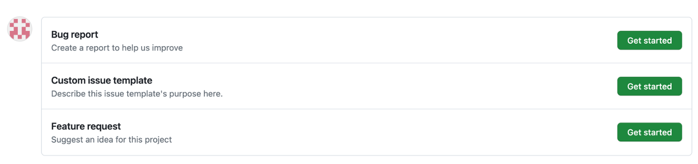

図4.63 - Issueテンプレートメニュー

Issueテンプレートは、詳細で構造化されたIssueレポートを作成する際のガイドとなります。さまざまな種類のIssue（バグ報告、機能リクエストなど）に対して特定のテンプレートを提供することで、必要な情報がすべて含まれるようになり、理解が容易になり、解決が早くなります。

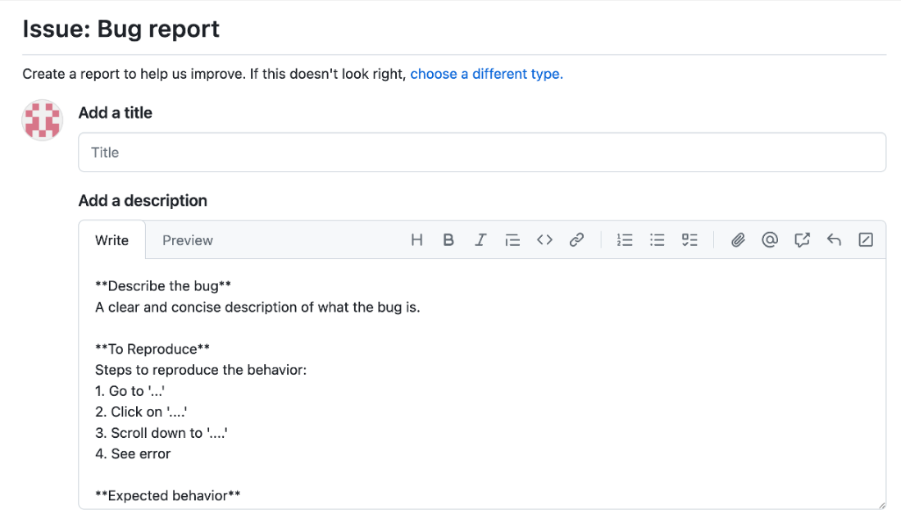

図5.64 - Issueテンプレートの例

Pull Requestのテンプレートは、すべてのPull Requestがプロジェクトの標準や要件に準拠していることを保証します。これらのテンプレートには通常、チェックリスト、変更内容を記述するセクション、関連するissueを参照するセクション、その他の注記が含まれています。この標準化により、レビュープロセスが簡素化され、コントリビューションの品質が向上します。

これらのコンポーネントはそれぞれ、よく整理され、アクセスしやすく、貢献者に優しい GitHub リポジトリを形成する上で重要な役割を果たしています。これらの標準的な基本文書やテンプレートを実装することで、DevOps やオープンソース文化のベストプラクティスと共鳴しながら、コラボレーションやプロジェクト管理のための強固な基盤を築くことができます。
